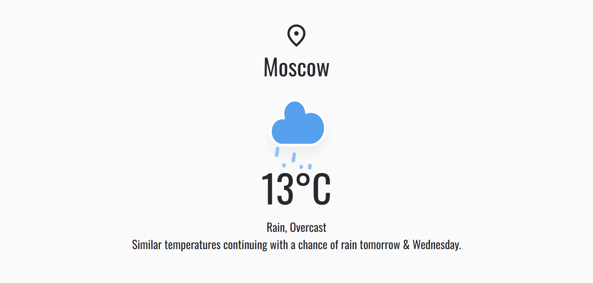
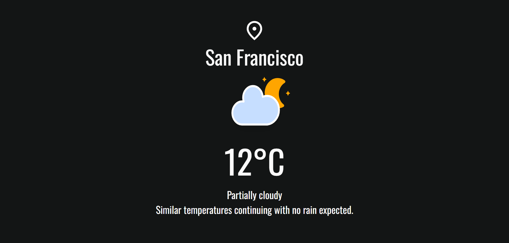

# Weather Application

A weather forecast application built with JavaScript and Webpack as part of [The Odin Project](https://www.theodinproject.com/) curriculum.

## Preview

  
  

**Live Demo**: [Weather App](https://wrzdx.github.io/Weather-App/)

## Features
- Real-time weather data from VisualCrossing API
- Temperature display in °C/°F toggle
- Responsive design with dark/light theme (depends on local time)
- Weather condition icons

## Key Concepts
✅ API integration with async/await  
✅ JavaScript Class for weather data handling  
✅ Webpack asset management  
✅ Dynamic DOM rendering  
✅ Error handling for failed requests  


## Core Functionality
- Get current weather by location
- Display weather conditions with appropriate icons
- Toggle temperature units
- Handle invalid location inputs

## How to Run
1. Clone the repository:
```bash
git clone https://github.com/wrzdx/Weather-App.git
```
2. Install dependencies:
```bash
npm install
```

3. Start development server:
```bash
npm webpack serve
```
5. Open `http://localhost:8080` in your browser


## API Reference
Uses [VisualCrossing Weather API](https://www.visualcrossing.com/weather-api)

---

*Part of The Odin Project's [JavaScript Course](https://www.theodinproject.com/paths/full-stack-javascript/courses/javascript)*  
*Focuses on API integration and asynchronous JavaScript*  
